### About Me
Hey there! I'm **Ashutosh Kumar Rao**, a Next.js Full-Stack Dev and AI Developer in my final year of engineering. If an idea pops into my head, chances are I'll build it and ship it.

Right now I'm a **Platform & Product Systems Engineer** at an early-stage startup, building the backend from scratch: API design, database architecture, auth, cloud infra and reliability, on AWS with a modular monolith architecture built to scale.

